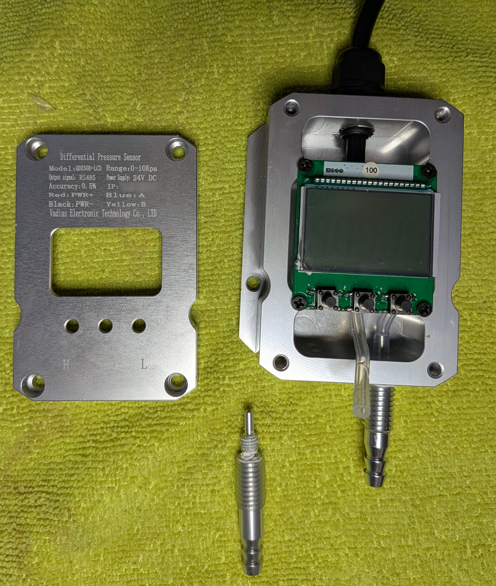
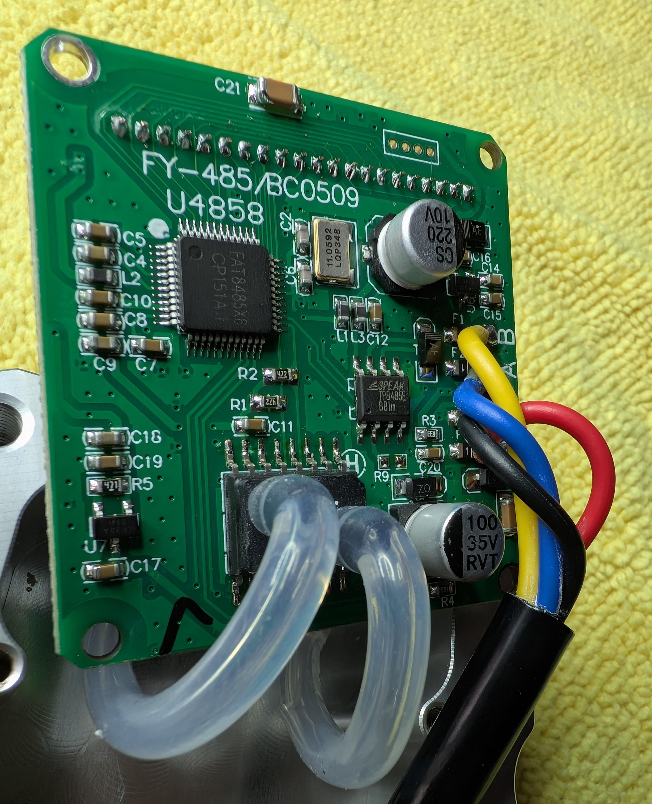

# qdx50d-air-pressure-sensor-poc

This is a proof of concept for the QDX50D air pressure sensor.
As far as I can tell, this particular air pressure probe is available from many sellers on AliExpress, eBay, Amazon, etc.
In some cases, they appear to re-brand it as their own.
I don't know if the unit I have is a re-branded version or not so your milage may vary.

- [qdx50d-air-pressure-sensor-poc](#qdx50d-air-pressure-sensor-poc)
  - [teardown](#teardown)
  - [Datasheet](#datasheet)

## teardown

Easy to open and not much to see inside.
The only thing to be careful around is the probe ports and the tiny tube that connects them to the actual sensor. If you need to remove either of the probe ports, you'll want to be mindful of the tube as you unscrew the port.

Other than that, it's a solid chunk of aluminum with a PCB inside.

The LCD isn't trivial to remove so here's a peek @ the back side of the main PCB with the actual microcontroller.

The PCB is marked

`FY-485/BC0509`

The rs485 chip is a `3PEAK TP8485E`. The main micro/cpu is labeled `FAT8485X6 / CP151A1` but nothing comes up when I search for that.

## Datasheet

I'm going to give the seller the benefit of the doubt and chock my struggles to get the datasheet as a "lost in translation" issue.
After _several_ back/forth messages, I was finally provided with what I think are _screenshots_ of a poorly translated document.
They are in the [`_docs/datasheet` folder](_docs/datasheet/) if you're curious.

I have pulled out the interesting registers / enum values and commented them in the [`src/basic.py`](src/basic.py) file.
Some registers/values are still a bit of a mystery but I have the basics working.
